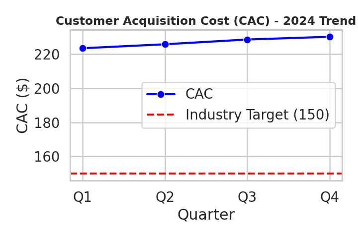

# Customer Acquisition Cost (CAC) - 2024 Analysis

**Author:** 23f2003824@ds.study.iitm.ac.in  

## Data Summary
- Q1: 223.32  
- Q2: 225.64  
- Q3: 228.43  
- Q4: 230.02  
- **Average CAC (2024): 226.85**  
- **Industry Target:** 150  

## Key Findings
- CAC has **increased steadily** throughout 2024, from 223.32 in Q1 to 230.02 in Q4.  
- The **average CAC (226.85)** is significantly above the industry benchmark of **150**, indicating inefficiencies in customer acquisition spending.  

## Business Implications
- Current acquisition strategies are **costly and unsustainable**, reducing profit margins.  
- Without corrective action, CAC will continue rising, making it harder to compete with industry peers.  

## Recommendations
To reduce CAC and reach the target of **150**, the company should:
1. **Optimize digital marketing channels** – focus on high-ROI platforms, cut low-performing spend.  
2. **Leverage data-driven targeting** – improve segmentation and reduce wasted ad spend.  
3. **Enhance referral and retention programs** – lower CAC by relying more on existing customer networks.  

## Visualization
The following chart shows the quarterly CAC trend compared to the industry target:  

